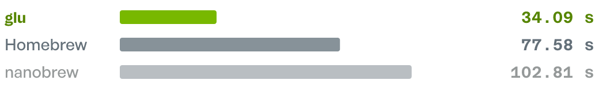
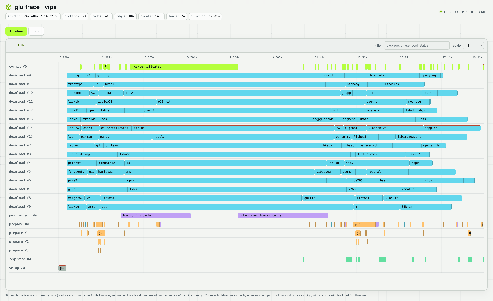

<p align="center">
  
</p>

<h1 align="center">glu</h1>

<p align="center">The fast package manager for macOS, written in Rust.</p>

<p align="center">
  <a href="https://glu.run/docs/">Documentation</a> ·
  <a href="https://glu.run/benchmarks/">Benchmarks</a> ·
  <a href="https://glu.run/">Website</a>
</p>

<p align="center">
    <picture>
      <source media="(prefers-color-scheme: dark)" srcset="docs/assets/benchmark-vips-dark.png">
      
    </picture><br>
    <em>Installing <a href="https://glu.run/packages/vips">vips</a> with all dependencies from a cold cache, including downloads.</em>
</p>

## Why glu

- **Fast end to end.** Downloads, preparation, and installation overlap to finish sooner.
- **8,000+ packages available.** Install command-line tools from Homebrew’s ecosystem of prebuilt packages.
- **No `brew update` step.** Package metadata is resolved from the registry as part of the operation.
- **Concise output by default.** Clear progress and useful errors keep everyday commands readable.
- **JSON Schema and plan mode for agents.** Structured output and previews let agents inspect changes before applying them.
- **Declarative package state.** `glu.json` records the packages you chose; glu manages their dependencies.
- **Built-in observability.** Every install records a local trace showing where time goes.

## Install

glu supports macOS on Apple Silicon.

```sh
curl -fsSL https://glu.run/install | bash
```

> [!TIP]
> **Let your agent introduce glu**
>
> Ask your coding agent:
>
> ```text
> Run `glu help --json --schemas`. Explain what makes glu useful and show
> me how to manage packages safely. Do not make any changes.
> ```
>
> This read-only command provides the command manifest and JSON Schemas, so agents can discover the interface without scraping terminal help.

### Upgrade

Upgrade glu to the latest version:

```sh
glu upgrade
```

## How glu works

```sh
glu trace view
```

<picture>
  <source media="(prefers-color-scheme: dark)" srcset="docs/assets/vips-trace-dark.png">
  
</picture>

*A recorded vips install in glu’s trace viewer.*

- **[One-shot server-side resolution](https://glu.run/docs/deep-dives/one-shot-resolve/).** Fetch the complete dependency graph and install metadata in one round trip. No local index to refresh.
- **[Built-in observability](https://glu.run/docs/reference/traces/).** Every install records a local trace, showing where time goes without uploading data.
- **[Critical-path scheduling](https://glu.run/docs/deep-dives/orchestrator/).** Prioritize downloads that unlock expensive work.
- **[Parallel, multipart downloads](https://glu.run/docs/deep-dives/orchestrator/).** Fetch packages concurrently and split large downloads into chunks.
- **[Overlapping stages](https://glu.run/docs/deep-dives/orchestrator/).** Download, extract, prepare, and install concurrently where dependencies allow.
- **[Shared resource limits](https://glu.run/docs/deep-dives/orchestrator/).** Coordinate network, CPU, memory, and filesystem work.
- **[Coalesced postinstall work](https://glu.run/docs/deep-dives/postinstall/).** Rebuild shared caches once, after all contributing packages are ready.
- **Written in Rust.** Native performance, with explicit control over concurrency and memory.

Read more about [performance](https://glu.run/docs/concepts/performance/).

## Common commands

Follow the [Quick Start](https://glu.run/docs/quick-start/) for a walkthrough, or browse the [CLI reference](https://glu.run/docs/reference/cli/) for all commands.

| Task                              | Command                     |
| --------------------------------- | --------------------------- |
| Install a package                 | `glu install vips`          |
| Sync from `glu.json`               | `glu install`               |
| Preview an installation           | `glu install vips --plan`   |
| Show the installed dependency tree | `glu list --tree`          |
| Explain why a package is installed | `glu why <name>`           |
| Inspect the latest trace          | `glu trace view`            |
| Discover commands and schemas     | `glu help --json --schemas` |

## Development

```sh
cargo build-local
./target/local/glu --version
```

Contributor documentation:

- [Codebase documentation](docs/README.md)
- [Architecture](docs/explanation/architecture.md)
- [Install pipeline](docs/explanation/install-pipeline.md)
- [State model](docs/explanation/state-model.md)
- [Security and correctness](docs/explanation/security-and-correctness.md)
- [CLI behavior](docs/reference/cli-behavior.md)
- [Registry contract](docs/reference/registry-contract.md)
- [Release process](RELEASING.md)

User documentation is available at [glu.run/docs](https://glu.run/docs/).

## License

Original glu source is available under the MIT License. `glu-client` also contains portions adapted from Homebrew under the BSD 2-Clause License. See [`LICENSE-MIT`](LICENSE-MIT), [`LICENSE-BSD-2-Clause`](LICENSE-BSD-2-Clause), and [`THIRD_PARTY_NOTICES.md`](THIRD_PARTY_NOTICES.md).

The generated dependency license report is in [`THIRD_PARTY_LICENSES.html`](THIRD_PARTY_LICENSES.html).

glu is an independent project and is not affiliated with or endorsed by Homebrew or Apple Inc.
